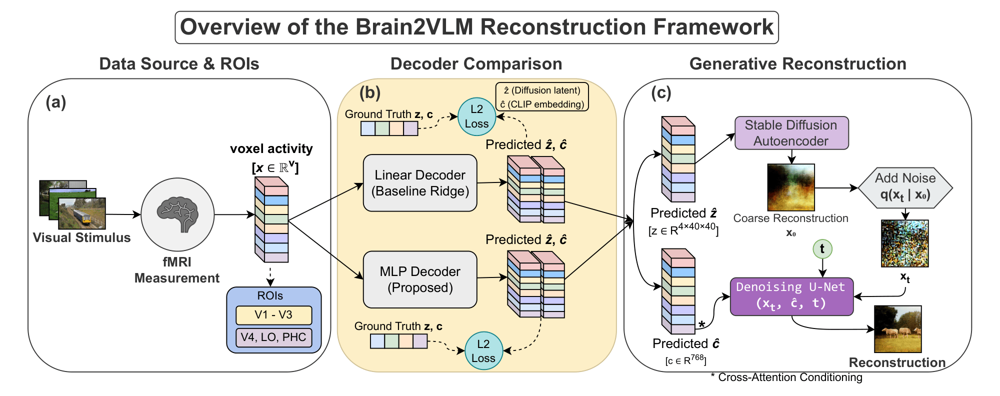
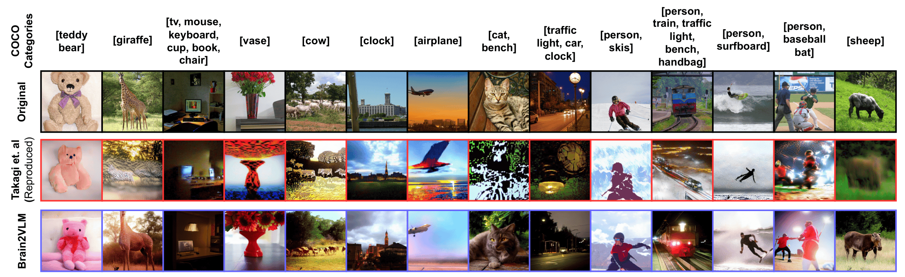

[](https://opensource.org/licenses/MIT)
[](https://doi.org/10.64898/2026.04.23.720313)
[](https://www.python.org/)

# Brain2VLM: Hierarchical Alignment Between Cortical Representations and Vision-Language Latent Spaces

# General Information

This repository contains the official implementation of **Brain2VLM**, a framework for analyzing brain-to-latent alignment in diffusion-based image reconstruction.

Recent approaches reconstruct images from fMRI by mapping neural activity into latent spaces of pretrained generative models. However, the **structure of this mapping remains poorly understood**.

In this work, we show that:

- Brain-to-latent alignment is **hierarchical**
- Early visual cortex aligns with **diffusion latents (z)** (approximately linear)
- Higher visual cortex aligns with **semantic embeddings (c)** (strongly nonlinear)

We introduce a **Residual MLP decoder** to model this structure and analyze its effect on reconstruction.

# Method Overview

<p align="center">

</p>

The pipeline consists of:

- fMRI voxel activity → decoder (ridge / MLP)
- Predict latent representations:
  - Diffusion latent `z`
  - CLIP embedding `c`
- Reconstruction using **Stable Diffusion (frozen)**

# Qualitative Results

<p align="center">

</p>

- Improved **semantic consistency** (object identity)
- Limited improvement in **fine-grained details**

---

# Environment Setup
1. Setup the env and data files.  
3. Install Stable Diffusion v1.4 (under the ``diffusion_sd1/`` directory), download checkpoint (``sd-v1-4.ckpt``), and place it under the ``codes/diffusion_sd1/stable-diffusion/models/ldm/stable-diffusion-v1/`` directory.  

# Install Dependencies
```
python -m venv .venv
source .venv/bin/activate

pip install "pip<24.1"
pip install setuptools wheel setuptools-scm packaging

pip install -r requirements.txt --no-build-isolation
```
# MRI Preprocessing
```
cd codes/utils/
python make_subjmri.py --subject subj01
```

# Reconstruction
```
cd codes/utils/
python img2feat_sd_batching.py  --imgidx 0 73000 --gpu 0 --batch_size 30
python make_subjstim.py --featname init_latent --use_stim each --subject subj01
python make_subjstim.py --featname init_latent --use_stim ave --subject subj01
python make_subjstim.py --featname c --use_stim each --subject subj01
python make_subjstim.py --featname c --use_stim ave --subject subj01

python ridge.py --target c --roi ventral --subject subj01
python ridge.py --target init_latent --roi early --subject subj01

python -u mlp.py --target c --roi ventral --subject subj01 2>&1 | tee logs/run_normal_mlp_c.txt
python -u mlp.py --target init_latent --roi early --subject subj01 2>&1 | tee logs/run_normal_mlp_c.tx

cd codes/diffusion_sd1/
python diffusion_decoding.py --imgidx 0 --gpu 0 --subject subj01 --method cvpr/mlp
```

# Evaluation
```
cd codes/utils/
python img2feat_decoded.py --gpu 0 --subject subj01 --method cvpr
python img2feat_decoded.py --gpu 0 --subject subj01 --method mlp

python identification.py --usefeat inception --subject subj01 --method cvpr
python identification.py --usefeat inception --subject subj01 --method mlp

python extract_feats.py --gpu 0 --subject subj01 --method cvpr
python extract_feats.py --gpu 0 --subject subj01 --method mlp
python overall_eval.py --subject subj01 --methods cvpr mlp --output_csv eval_results.csv
```

---

# Acknowledgement
Our codebase builds on these repositories. We would like to thank the authors. 

> https://github.com/yu-takagi/StableDiffusionReconstruction

> https://github.com/ozcelikfu/brain-diffuser

> https://github.com/CompVis/stable-diffusion

> https://github.com/openai/CLIP

> https://github.com/CompVis/taming-transformers

> https://github.com/tknapen/nsd_access

> https://github.com/KamitaniLab/brain-decoding-cookbook-public

---
